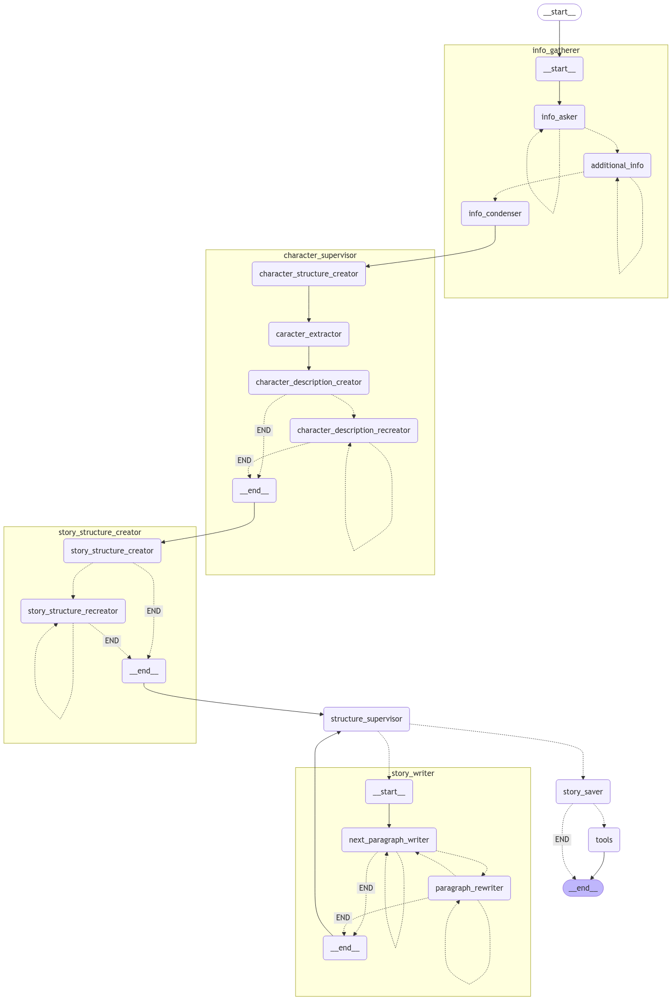

# InkreaLLM 


In today's creative landscape, the process of transforming ideas into fully realized literary works can be both time-consuming and mentally demanding. The traditional approach often involves hours of solitary ideation, painstaking drafting, and multiple rounds of revisions –  that can diminish the author's energy and enthusiasm.
However, what if there was an innovative approach that could dramatically streamline this creative process? Imagine a system that allows writers to collaborate seamlessly with adaptive Multi Agents to enhance and accelerate their creative output.

## Table of Contents
* [The Use Case](#the-use-case)
* [Arhitecture Overview](#arhitecture-overview)
* [Tools & Frameworks](#tools-&-frameworks)
* [Setup Instructions](#setup-instructions)  
      * [Prerequisites](#prerequisites)  
      * [Installation](#installation)  
      * [Running the application](#running-the-application)  

    

## The Use Case

Unfortunately, many tools available to writers today are either too generic or lack the depth needed to assist with advanced storytelling. This often results in increased mental effort, longer writing periods, and diminished creative output. 
Our solution is designed for the **applications track** and features a modular Multi-Agent framework using LangGraph which organizes the system into smaller, specialized agents called subgraphs. 

Each subgraph is tasked with a particular aspect of the writing process such as developing story elements, characters, and creating plotlines. This modular approach allows the system to focus on specific tasks while maintaining cohesion across the overall narrative.

## Arhitecture Overview

Our writing assistant is designed as an interconnected graph where each agent represents a specialized node with a unique role in the creative process.

### 1. Info Gatherer Subgraph

- *info_asker*: This agent is responsible for asking the user for the information needed to generate the writing (e.g. genre, characters, setting, etc.). The questions are designed based on the previous user answer and for every writing type the questions are different. 
- *additional_info*: This agent is responsible for asking the user for additional information needed to generate the writing (e.g. character's name, character's age, character's occupation, etc.). Can terminate the information gathering process.
- *info_condenser*: Summarizes the entire conversation and extract key information from the previous messages. Also, structures the information in a list format of "question: answer".

### 2. Character Supervisor Subgraph

- *character_structure_creator*: This agent creates a general set of character attributes based on story information.
- *character_extractor*: Agent that extracts characters from the story information and generates names and descriptions if not explicitly provided. Returns a JSON list of characters.
- *character_description_creator*: Agent that creates detailed character descriptions, using the previously defined character structure. Fills in character details based on story information.
- *character_description_recreator*: agent that rewrite the characters information based on the requirements from the user input, if any.

### 3. Story Structure Creator Subgraph

- *story_structure_creator*: Agent that creates the structure of the writing. (for each genre the agent create a specific structure).
- *story_structure_recreator*: Agent that recreate the structure of the writing based on the user suggestions.
 
*structure_supervisor*: structure_supervisor: agent that analyze the structure of the story, substract unit information for each unit (title and unit length for every chapter) and flag the end of the story.

### 4. Story Writer Subgraph

- *next_paragraph_writer*: agent that write paragraphs of the story (one by one). A paragraph being a fragment of the writing, not a paragraph per se.
- *paragraph_rewriter*: agent that recreate paragraphs of the story based on the user preferences if any (using the paragraph created by the previous agent).

*story_saver*: give a title to a text if necessary & saves the writing in a txt file using a tool function.



## Tools & Frameworks

- **Python**: As our primary programming language, Python offers an intuitive, versatile environment with robust libraries that streamline complex project development. Its extensive ecosystem of AI and data processing tools makes it ideal for our creative writing assistant.

- **LangGraph**: This library enables the creation of our multi-agent workflow. By maintaining a persistent, mutable state shared across different agents, LangGraph allows us to build an interactive system where each node can dynamically process, modify, and pass along information. This capability is crucial for our collaborative writing creation application.

- **LangChain**: Serving as a critical middleware for our AI interactions, LangChain provides advanced prompt engineering capabilities. We leverage its prompt templates to create structured, context-aware prompts for our OpenAI language model. The `.with_structured_output()` method is particularly valuable, allowing us to generate cleanly formatted JSON responses that can be easily integrated into our workflow.

- **Streamlit**: For the interface part we use Streamlit, to provide for the user a user-friendly front-end that integrates with our LangGraph multi-agent system. 


## Setup Instructions

### Prerequisites

- Python 3.8+
- OpenAI API Key
- Gemini API Key

### Installation

- Clone the repository
- Create a Virtual Environment by running `python -m venv venv`
- Install the required libraries by running `pip install -r requirements.txt`
- Set Up API Credentials by creating a `.env` file in the root directory and adding the following lines:
   ```
   OPENAI_API_KEY=YOUR_API_KEY
   GEMINI_API_KEY=YOUR_API_KEY
   ```
### Running the application
- Run the Streamlit app by typing `streamlit run app1.py`
- Start interacting with the writing assistant by following the instructions.
- The app will open like this in your browser:


- You can answer the questions from Chat History in order to proceed with the writing process.

- To send a mesage to the assistant - type your message in the input box and use the Send button (Enter will move the cursor to the next line).

- When FINISH appears in the chat history - you need to confirm it by clicking on the Send button.

- After each paragraph is created in the chat history you can send suggestions to the assistant in order to rewrite the paragraph.

- After the character structure or the story structure is created you can send suggestions to the assistant in order to recreate the structure.

- DO NOT press the Send button when the Assistant is 'thinking' (the RUNNING status is displayed on the right top corner of the page) - this can result in Assistant's crash.